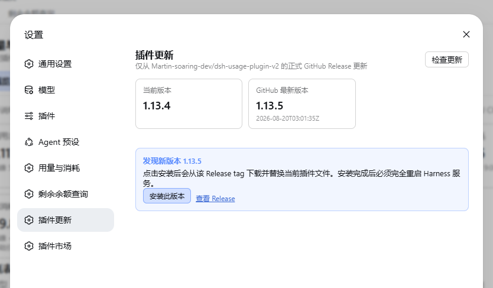
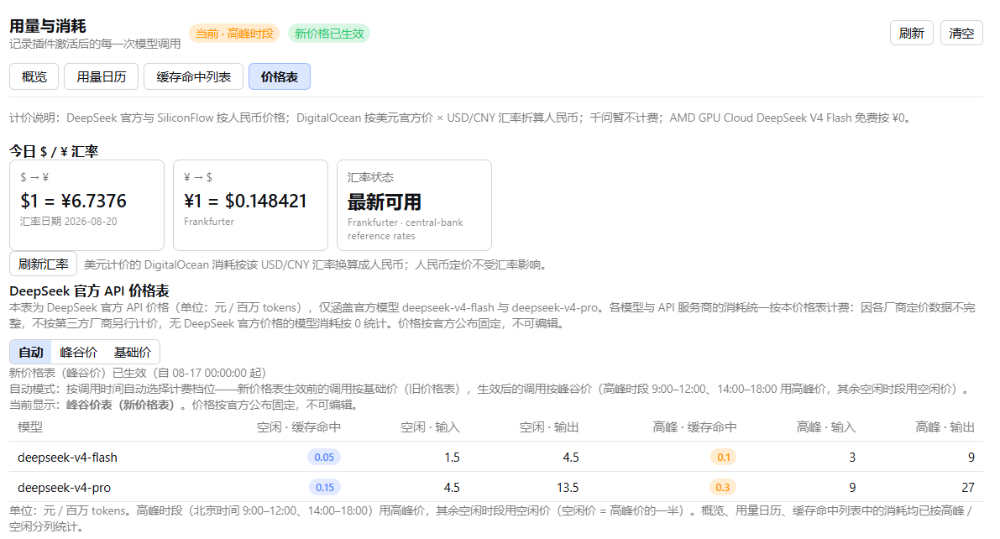
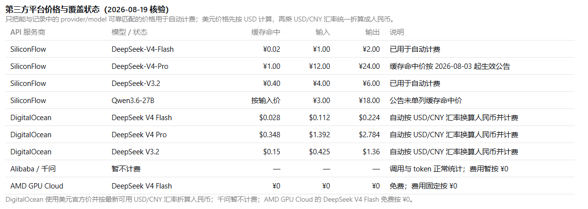
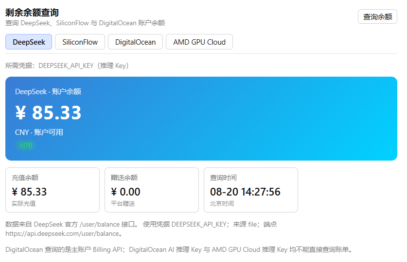
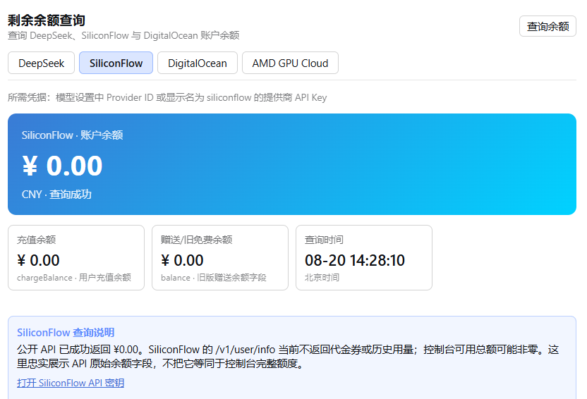
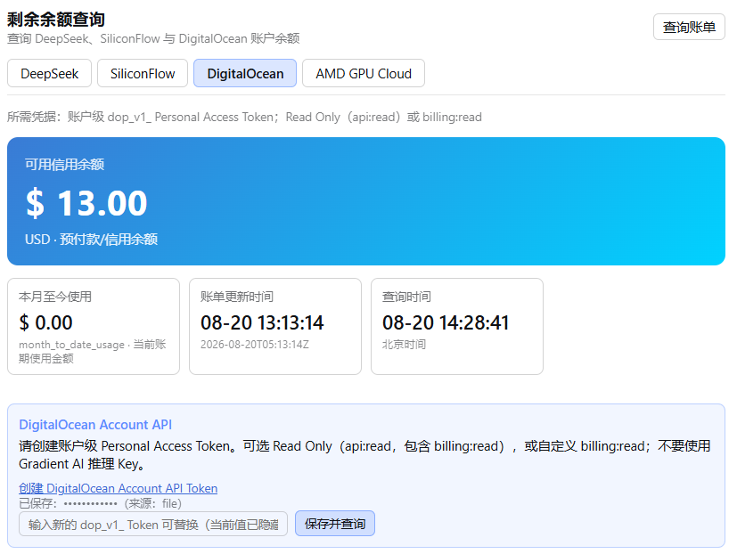
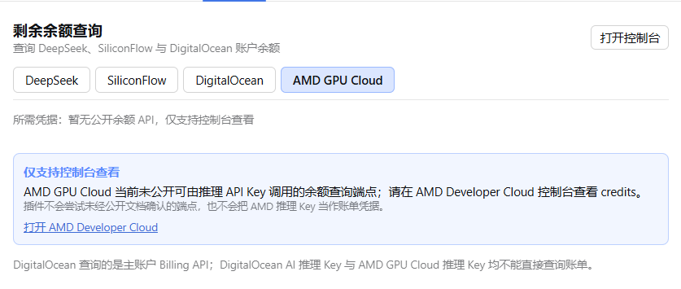

<div align="center">

# DeepSeek Harness Usage & Cost Tracker v2

**English** · [简体中文](./README.zh.md)

[This fork](https://github.com/Martin-soaring-dev/dsh-usage-plugin-v2) · [Latest Release](https://github.com/Martin-soaring-dev/dsh-usage-plugin-v2/releases/latest) · [Original project](https://github.com/feiyang-dev/dsh-usage-plugin)

**An independent community fork focused on extending the original usage & cost tracker for multi-provider workflows.**

</div>

---

## About this fork

This repository is based on [feiyang-dev/dsh-usage-plugin](https://github.com/feiyang-dev/dsh-usage-plugin). The original project provides the core DeepSeek Harness usage/cost tracking experience; this fork keeps that foundation and focuses its README on the changes introduced here.

For the original project's full documentation, installation notes, FAQ, data paths, and feature description, see:

- [Original project on GitHub](https://github.com/feiyang-dev/dsh-usage-plugin)
- [Archived original README — English](./README-origin.md)
- [Archived original README — 简体中文](./README-origin.zh.md)

## What this fork changes

### Multi-provider balance support

The balance page has been extended beyond DeepSeek:

- **DeepSeek** — keeps the original balance query behavior.
- **SiliconFlow** — reads the API key from the configured SiliconFlow model provider, restricts requests to official SiliconFlow hosts, and displays the public API balance fields with field explanations.
- **DigitalOcean** — uses an account-level Personal Access Token instead of a Gradient AI inference key, queries the account Billing API, and displays available credit plus month-to-date usage.
- **AMD GPU Cloud** — explicitly reports that no documented inference-key balance endpoint is available and links users to the official console instead of guessing an unsupported API.

### Provider-aware cost accounting

Usage cost calculation was extended to distinguish API providers rather than assuming one universal price source. Provider/model information is surfaced in the usage overview, while unsupported or intentionally unpriced routes can remain at zero cost instead of receiving a misleading estimate.

### Exchange-rate support

DigitalOcean billing values are denominated in USD, while several other providers use CNY. This fork adds daily USD/CNY exchange-rate retrieval and caching so cross-provider cost presentation can remain consistent without hard-coding a permanent conversion rate.

### Safer credential handling

Provider credentials are handled according to their actual purpose:

- inference keys and account-level billing tokens are kept separate;
- DigitalOcean tokens are masked after saving;
- plaintext credentials are not returned to the browser client;
- unsupported provider endpoints are not guessed or probed.

### GitHub Releases-only distribution and in-plugin updater

This fork is maintained through GitHub Releases rather than publishing its own npm package. The plugin includes a manual update checker that compares the installed version with the latest release and can install a newer release into the active DSH profile.

## Screenshots

### GitHub Release updater

The plugin can check the latest GitHub Release from DSH settings and install it into the active profile.



### Provider-aware pricing and USD/CNY exchange rate

The price table now includes the current USD/CNY exchange rate, official DeepSeek pricing, and provider-specific pricing/coverage information for SiliconFlow, DigitalOcean, Alibaba/Qwen and AMD GPU Cloud.





### Multi-provider balance query

The balance panel exposes provider-specific behavior for DeepSeek, SiliconFlow, DigitalOcean and AMD GPU Cloud rather than pretending all providers share one balance API.









### Installation for this fork

With the standard DeepSeek Harness installed, plugin could be installed using:

```bash
dsh plugin --profile web add "https://github.com/Martin-soaring-dev/dsh-usage-plugin-v2/archive/refs/tags/v1.13.5.tar.gz"
```

Then restart DeepSeek Harness:

```bash
dsh web
```

If the default Web port is already occupied, choose another port, for example:

```bash
dsh web --port 3070
```

## Development and maintenance disclosure

This is a human–AI collaborative project. Development, debugging, testing, documentation, release preparation, and ongoing maintenance are performed by the project maintainer with assistance from **OpenAI Codex (ChatGPT)**. The maintainer defines the goals, reviews the results, authorizes repository changes, and remains responsible for the released behavior.

## Credit and license

The original design and codebase come from [feiyang-dev/dsh-usage-plugin](https://github.com/feiyang-dev/dsh-usage-plugin) and its contributors. This fork does not replace or impersonate the upstream project.

MIT License. See the repository history for the exact changes made in this fork.
