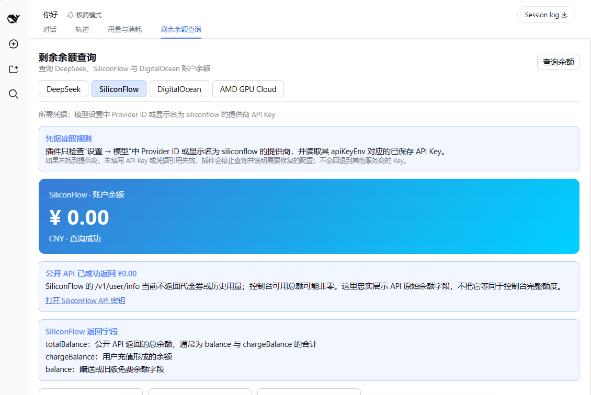
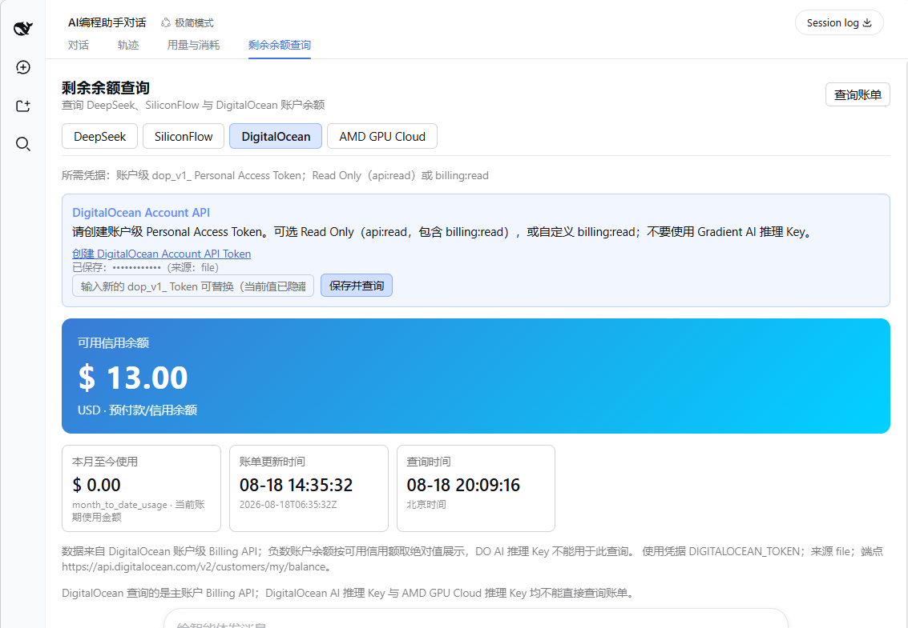
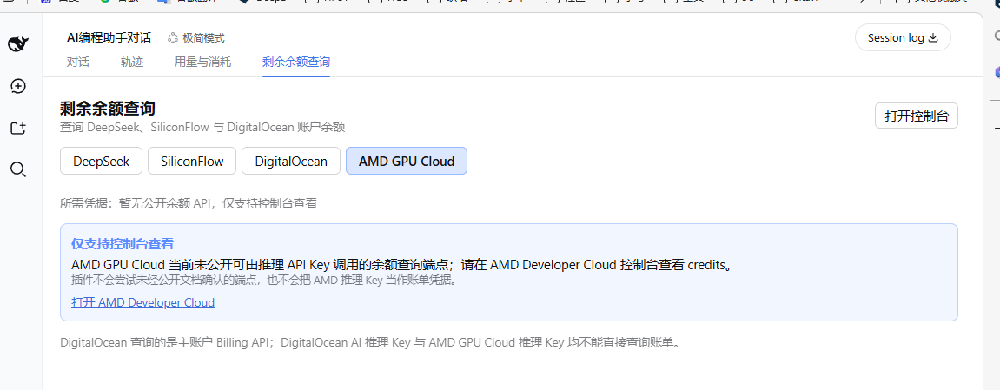
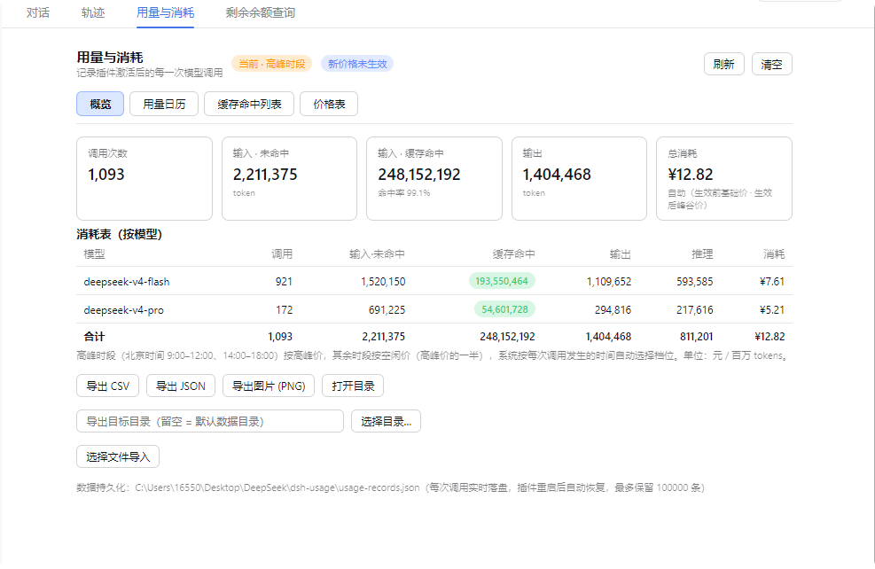
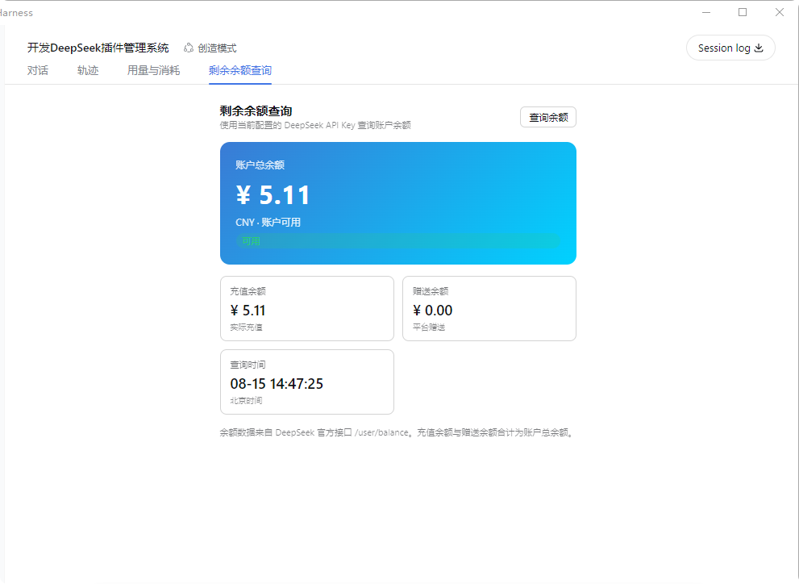

<div align="center">

# DeepSeek Harness 用量与消耗插件 v2

[English](./README.md) | **简体中文**

[本项目](https://github.com/Martin-soaring-dev/dsh-usage-plugin-v2) · [最新 Release](https://github.com/Martin-soaring-dev/dsh-usage-plugin-v2/releases/latest) · [原项目](https://github.com/feiyang-dev/dsh-usage-plugin) · MIT License

**基于原项目复刻并继续增强的社区版本** —— 保留完整的用量与消耗统计能力，并补齐多服务商余额查询所需的凭据识别、字段解释和安全边界。


</div>

---

## 第一部分：本项目的出发点与改动

### 项目的出发点

本项目基于 [feiyang-dev/dsh-usage-plugin](https://github.com/feiyang-dev/dsh-usage-plugin) 的公开代码复刻并继续开发。原项目已经解决了 DeepSeek Harness 中模型调用记录、token 用量、峰谷价格、缓存命中、日历统计和数据导出等核心问题；但在本仓库开始复刻时，余额查询主要面向 DeepSeek，而实际使用者往往会同时配置 SiliconFlow、DigitalOcean、AMD GPU Cloud 等不同服务商。

这些服务商的凭据和账单接口并不相同：有的可以使用推理 API Key 查询余额，有的必须使用账户级 Token，有的根本没有公开可由推理 Key 调用的余额端点。因此，v2 的目标不是简单增加几个按钮，而是在保留原项目能力的前提下，把“该用哪把 Key、调用哪个接口、返回字段代表什么、不能查询时如何说明”处理清楚。

本项目不冒充或替代原项目；原始设计、代码和贡献归功于原项目作者及贡献者，并继续遵循 MIT License。

### AI 协作与维护声明

这是一个人机协作项目。本项目的开发、测试、调试、文档整理、发布准备与持续维护，由项目维护者在 **OpenAI Codex（ChatGPT）** 的协助下完成。Codex 参与了需求分析、代码调查与实现、测试验证、问题排查和文档编写；项目维护者负责提出目标、授权涉及账户与凭据的操作、审核结果，并对合并、发布及项目最终行为承担责任。具体变更以 Git 提交历史为准。

### 本项目做了什么

- 将余额页扩展为 **DeepSeek、SiliconFlow、DigitalOcean 与 AMD GPU Cloud** 多服务商界面，同时保留原有用量、消耗、日历、缓存、价格、导入导出与持久化功能。
- **SiliconFlow**：只读取模型设置中 Provider ID 或显示名为 `siliconflow` 的提供商，并跟随该提供商的 `apiKeyEnv` 获取已保存 Key；仅接受 SiliconFlow 官方 `.cn` / `.com` 地址。页面忠实展示公开 API 返回的 `totalBalance`、`chargeBalance`、`balance` 等字段，即使返回值为 0 也不会用控制台余额替换。
- **DigitalOcean**：明确要求账户级 Personal Access Token，而不是 Gradient AI 推理 Key；页面提供创建链接和权限提示，Token 保存后隐藏显示。查询账户 Billing API，只展示当前账户余额与本月至今使用，不拉取账单历史明细；负账户余额按 DigitalOcean 的记账语义显示为可用信用余额。
- **AMD GPU Cloud**：由于没有公开文档化的推理 Key 余额接口，不猜测端点、不把推理 Key 当账单凭据，只提供官方控制台入口和清晰的支持状态。
- 余额请求由 Host 侧完成，明文凭据不返回前端；并为这些服务商契约与边界补充了自动化测试。

### 和原项目的区别

下表中的“原项目”指本仓库复刻时所依据的基线版本；上游后续可能继续变化。

| 维度 | 原项目（复刻基线） | 本项目 v2 |
| --- | --- | --- |
| 核心能力 | 用量与消耗统计、峰谷计费、日历、缓存命中、价格表、导入导出和持久化 | 完整保留，并继续兼容原有数据与界面流程 |
| 余额服务商 | 主要支持 DeepSeek 余额查询 | DeepSeek、SiliconFlow、DigitalOcean；AMD GPU Cloud 明确标为仅控制台查看 |
| 凭据来源 | 以推理 API Key 为主 | 按服务商区分：SiliconFlow 读取模型 Provider 的 `apiKeyEnv`，DigitalOcean 单独保存账户级 PAT |
| 返回值说明 | 展示 DeepSeek 余额字段 | 补充 SiliconFlow 字段定义、DigitalOcean 账户余额/信用余额语义与本月至今使用 |
| 不支持的接口 | 未形成多服务商状态说明 | 不请求未经官方文档确认的 AMD 余额端点，并在界面解释原因 |
| 安全与验证 | 沿用原项目的 Host + Client 插件结构 | 余额调用留在 Host 侧、Token 隐藏保存、限制 SiliconFlow 官方主机，并增加服务商契约测试 |
| 发行与更新 | 原项目通过 npm 分发 | 本项目只使用 GitHub Releases；设置页可手动检查并安装新版本 |

### 新增余额查询截图

#### SiliconFlow

自动从匹配的模型 Provider 读取凭据，并同时说明公开 API 的返回字段与查询结果。



#### DigitalOcean

账户 PAT 保存后隐藏，只展示可用信用余额、当前月使用与查询时间，不展示账单历史明细。



#### AMD GPU Cloud

没有公开可用端点时直接说明限制，并引导前往官方控制台查看 credits。



---

## 第二部分：原项目介绍（复刻与适配）

> 以下内容复刻并延续原项目的核心介绍、安装方式与数据说明。为与本项目 v2 的实际行为一致，余额服务商、凭据规则和截图等内容已作适配。原始项目及其历史请参阅 [feiyang-dev/dsh-usage-plugin](https://github.com/feiyang-dev/dsh-usage-plugin)。

> ## 🔔 重要说明：v2 仅通过 GitHub Releases 发行
>
> 本仓库是独立 fork，不发布 npm 包，也不会占用或冒用上游 `@feiyang666` scope。安装包与更新均来自本仓库的正式 GitHub Release。
>
> - 安装本 fork：`dsh plugin --profile web add "https://github.com/Martin-soaring-dev/dsh-usage-plugin-v2/archive/refs/tags/v1.12.0.tar.gz"`
> - 更新本 fork：打开 Harness 设置中的“插件更新”，点击“检查更新”；发现新版本后点击安装并完全重启服务。
> - 不要在同一个 DSH profile 中同时安装本 fork 与上游用量插件；两者提供相同功能入口，可能竞争相同的路由和面板。
> - 如需迁移，请先从该 profile 移除上游包，再安装本 fork。

---

### 简介

dsh-usage-plugin-v2 是 DeepSeek Harness 生态的**用量与消耗统计插件**（DSH plugin，Host + Client 双面一体包）。装好后在 WebUI 顶部「对话」「轨迹」之后会出现 **「用量与消耗」** 与 **「剩余余额查询」** 两个 tab：

> 支持 **Windows / macOS / Linux**：路径按当前平台处理（`node:path`），目录选择与「打开所在目录」均调用系统原生方式（macOS 用 `osascript` / `open`，Linux 用 `zenity` / `xdg-open`），余额查询与导出不依赖 Windows 专用命令。

- **用量与消耗**：记录每次模型调用的 token 用量与缓存命中（输入·未命中 / 缓存命中 / 缓存写入 / 输出 / 推理 / 结束原因），按 DeepSeek 峰谷/基础价格计算消耗（高峰时段自动按北京时间 9:00–12:00、14:00–18:00 计价）。模型名以请求参数为准如实显示（非 DeepSeek 模型不再显示为「未知模型」，无官方价格的模型消耗按 0 统计）。概览含「按模型」表与「按 API 服务商 × 模型」明细表（每个服务商一组，组内列出各模型的调用与高峰/空闲分列消耗），底部有总费用合计。
- **用量日历**：按月查看每日用量热力图（按消耗或调用数着色），悬停查看详情（含高峰 / 空闲消耗拆分）、点击某天查看当日调用明细与高峰/空闲消耗统计，附本月每日统计表（高峰消耗 / 空闲消耗 / 总消耗分列）与月度汇总。
- **缓存命中列表**：最新记录排在最前，支持 今天 / 近7天 / 近30天 / 全部 快捷筛选与自定义起止日期区间，汇总行与表尾合计区分高峰消耗 / 空闲消耗 / 总费用合计；列表分页渲染（每页 100 条），记录量大也不卡顿。
- **价格表**：**DeepSeek 官方 API 价格表**，展示基础价与峰谷价（高峰/空闲）单价表，高峰价与空闲价分列展示，支持在面板内直接编辑价格并持久化（数据目录 `pricing.json`），也可一键恢复默认。
- **剩余余额查询**：DeepSeek 与 SiliconFlow 可直接使用推理 Key 查询；SiliconFlow 会跟随匹配的自定义模型提供商 `apiKeyEnv` 与官方 `.cn` / `.com` 地址；DigitalOcean 使用账户级 Billing API。AMD GPU Cloud 因未公开推理 Key 可调用的余额端点，面板会显示“仅支持控制台查看”，不会猜测或调用未经确认的接口。
- **导出**：CSV / JSON / **PNG 长图**（按最新在前展示，最多含最近 2000 条，超出会提示；PNG 报告含高峰 / 空闲消耗分列统计），可导出到任意目录（原生目录选择器），导出后自动打开所在目录。
- **导入**：选择文件（JSON / CSV）合并导入，按时间去重。
- **持久化**：记录实时落盘到 `<会话工作区>/dsh-usage/usage-records.json`，重启自动恢复（上限 100000 条，尽量多存）。
- **界面适配**：面板字号跟随应用「显示大小」设置自动缩放（em 相对字号），面板宽度以视口封顶、宽表格在容器内横向滑动（max-content + overflow-x），任何窗口大小下所有列与合计都完整可见，不会裁掉右侧内容。

#### 余额服务商支持情况

| 服务商 | 状态 | 凭据 | 展示内容 |
| --- | --- | --- | --- |
| DeepSeek | ✅ API 查询 | `DEEPSEEK_API_KEY` | 总余额、充值余额、赠送余额 |
| SiliconFlow | ✅ API 查询 | Provider ID 或显示名为 `siliconflow` 的模型提供商所引用的 `apiKeyEnv` | 公开 API 的总余额、充值余额与旧版赠送余额字段 |
| DigitalOcean | ✅ 账户级 Billing API | 在余额页输入账户 PAT，以 `DIGITALOCEAN_TOKEN` 安全保存（[创建 Token](https://cloud.digitalocean.com/account/api/tokens)） | 当前账户余额与本月至今使用（USD），不查账单明细 |
| AMD GPU Cloud | ℹ️ 仅控制台查看 | — | 前往 [AMD Developer Cloud](https://www.amd.com/en/developer/resources/cloud-access/amd-developer-cloud.html) 查看 credits；当前没有为推理 Key 公开文档化的余额端点 |

AMD GPU Cloud 会保留在服务商选择器中并明确说明支持状态，避免向猜测的端点发起无效请求。

---

### 界面预览

#### 用量与消耗


#### 剩余余额查询


### 推荐安装方式

首次安装使用 GitHub Release 命令：

```bash
# 前提：已安装 dsh（npm install -g @deepseek-ai/dsh）
dsh plugin --profile web add "https://github.com/Martin-soaring-dev/dsh-usage-plugin-v2/archive/refs/tags/v1.12.0.tar.gz"
```

也可对其它 profile 安装：

```bash
dsh plugin --profile web add "https://github.com/Martin-soaring-dev/dsh-usage-plugin-v2/archive/refs/tags/v1.12.0.tar.gz"
dsh plugin --profile headless add "https://github.com/Martin-soaring-dev/dsh-usage-plugin-v2/archive/refs/tags/v1.12.0.tar.gz"
```

装完重启 dsh web 服务即可。详细的手动安装 / 接线 / 卸载 / 排障说明见下方。

---

### 这个包是什么

一个 GitHub Release 安装包 = **host 半**（Node 侧 Cordis 插件，负责记录、计费、余额查询、导出与更新，见 `lib/index.js`）+ **client 半**（浏览器侧面板，见 `lib/client.js`，通过 `/usage/api` 与 host 通信）。

包通过两处声明接入 DSH：

| 声明 | 作用 |
| --- | --- |
| `dsh.bundle.patch`（`cordis.patch.yml`） | 让 DSH 把它识别为**标准 bundle 插件包**：`dsh plugin --profile <名> add <包名>` 一条命令即可安装并自动接线，无需手改任何配置文件 |
| `dsh.client` + `exports["./client"]` | 让 web 客户端在 `/plugins/<包名>/client.js` 自动加载浏览器面板 |

所以对使用者来说，**安装就是一条命令**，不用碰 YAML、不用手动复制文件。

---

### 安装（给使用者）

#### 0. 前提条件

- 已安装 DeepSeek Harness（`npm install -g @deepseek-ai/dsh` 全局安装，或使用基于它的桌面应用 / `npx @deepseek-ai/dsh web`）。
- 安装方式 A（推荐）需要 **pnpm**：`npm install -g pnpm`（或 `corepack enable`）。
- 确保 `dsh` 命令在 PATH 里（桌面应用自带环境则在其终端中执行）。

#### 1. 方法 A（推荐）：一条命令安装

```bash
dsh plugin --profile web add "https://github.com/Martin-soaring-dev/dsh-usage-plugin-v2/archive/refs/tags/v1.12.0.tar.gz"
```

这条命令会做三件事（全部自动）：

1. 在 `~/.dsh/profiles/web` 里通过 pnpm 安装本包（首次使用会自动初始化该 profile）；
2. 检测到包的 `dsh.bundle` 声明，自动把包名写进 profile 的 `dsh.profile.bundles` 层列表；
3. 重启后，DSH 启动时会自动读取包内的 `cordis.patch.yml`，把插件行挂进应用树——**不需要**手动编辑任何配置文件。

其它 profile 同理，把 `web` 换成你的 profile 名即可（如 `dsh plugin --profile headless add ...`；`dsh web` 等价于 `dsh --profile web`）。

> 想用本地 tarball 测试：`dsh plugin --profile web add C:\path\to\dsh-usage-plugin-v2-1.12.0.tgz`

#### 2. 方法 B：手动安装（不使用 pnpm / 无 `dsh plugin`）

只在没有 pnpm 或需要完全手工控制时才用。请**不要在 `~/.dsh/profiles` 根目录直接 `npm install`**（该目录没有 package.json，npm 会把整个 node_modules 当残留清掉）。

**B1. 用 pnpm 但不用 `dsh plugin`：**

```bash
cd ~/.dsh/profiles/web
pnpm add "https://github.com/Martin-soaring-dev/dsh-usage-plugin-v2/archive/refs/tags/v1.12.0.tar.gz"
# 然后手动把插件行加进 web/cordis.patch.yml（见 B3），再重启
```

**B2. 或用 npm 客户端安装 GitHub 压缩包：** 在 profile 目录先补一个最小 package.json 再装（这不会从 npm Registry 下载本插件）：

```bash
cd ~/.dsh/profiles/web
# 若该目录还没有 package.json（用 dsh plugin 初始化过才会有）：
# echo '{"name":"dsh-profile-web","private":true,"dependencies":{}}' > package.json
npm install "https://github.com/Martin-soaring-dev/dsh-usage-plugin-v2/archive/refs/tags/v1.12.0.tar.gz"
```

**B3. 接线（只需做一次，幂等）：** 在 `~/.dsh/profiles/web/cordis.patch.yml` 末尾追加：

```yaml
- insert:
    - id: usage-plugin
      name: 'dsh-usage-plugin-v2'
      inject:
        - fs
        - webServer
        - subprocess
        - credentials
        - settings
        - sandboxPolicy
        - agents
```

也可以直接跑包内的接线脚本（自动找 profile 并追加，幂等）：

```bash
node node_modules/dsh-usage-plugin-v2/scripts/wire.js
```

> ⚠️ 行上的 `inject` 列表**不能省略**：它让 Cordis 等到 `fs` / `webServer` / `subprocess` / `credentials` / `settings` / `sandboxPolicy` / `agents` 服务就绪后再激活插件。缺了它，`/usage/api` 路由不会注册，面板会报 `Unexpected end of JSON input`。

#### 3. 方法 C：桌面应用

桌面版（如 [DeepSeek Harness 桌面版](https://github.com/feiyang-dev/DeepSeek-Harness-Desktop)）底层就是同一个 `~/.dsh/profiles`。在任意终端执行方法 A 的命令即可，装完重启应用；应用内启动的是同一个 `dsh web`，插件自动生效。

#### 4. 重启并验证

重启 DeepSeek Harness 的 web 应用（命令行：结束旧进程后重新运行 `dsh web`；桌面应用：完全退出后重新打开）。然后：

- 刷新 http://127.0.0.1:3080 ，顶部「对话」「轨迹」之后会出现 **「用量与消耗」** 和 **「剩余余额查询」** 两个 tab；设置里也有对应入口。
- 「用量与消耗」面板内含 **概览 / 用量日历 / 缓存命中列表 / 价格表** 四个子页签。
- 发一条消息后，「用量与消耗」面板应出现本次调用的 token / 消耗记录。

#### 5. 配置（余额查询需要）

余额面板按服务商读取不同凭据。查询前，请将相应凭据添加到 DSH 凭据服务。

| 服务商 | 查询来源 | 重要说明 |
| --- | --- | --- |
| DeepSeek | `GET https://api.deepseek.com/user/balance` | 使用配置 DeepSeek 模型时的同一个推理 Key |
| SiliconFlow | 在匹配的官方 `.cn` / `.com` API 主机调用 `GET /v1/user/info` | 必须有 Provider ID 或显示名为 `siliconflow` 的模型提供商；只读取该提供商的 `apiKeyEnv`，不回退到独立环境变量 |
| DigitalOcean | `GET https://api.digitalocean.com/v2/customers/my/balance` | 在余额页输入带 `billing:read` 的[账户级 Personal Access Token](https://cloud.digitalocean.com/account/api/tokens)；由 DSH 凭据服务保存，保存后只显示遮罩值 |
| AMD GPU Cloud | [AMD Developer Cloud](https://www.amd.com/en/developer/resources/cloud-access/amd-developer-cloud.html) | 选择后显示“仅支持控制台查看”，不会发送余额请求 |

打开「剩余余额查询」tab 并选择服务商。请求在 Host 侧执行，凭据明文不会返回给浏览器 UI。为避免泄露，SiliconFlow 模型凭据只会发送到 `api.siliconflow.cn` 或 `api.siliconflow.com`，不会发送到任意自定义网关。DigitalOcean 页面保存账户 PAT 后只查询账单概要，不请求 billing history，也不会把推理 Key 误当作账单凭据。

---

### 卸载

```bash
dsh plugin --profile web remove dsh-usage-plugin-v2
```

（等价于 pnpm remove；`dsh plugin` 会自动把包名从 `dsh.profile.bundles` 层列表里移除。）然后重启应用即可。

手工安装的（方法 B），反向操作：删除 `cordis.patch.yml` 里的 `usage-plugin` 行，再 `pnpm remove` / `npm uninstall` 该包，重启。

> 从 1.0.x 手工接线版升级到 1.1.x 时：先删掉旧 `cordis.patch.yml` 里的 `usage-plugin` 行（或整体按卸载流程走一遍），再按方法 A 重装，避免同一插件被挂载两次。

---

### 数据与位置

- 数据文件：`<会话工作区>/dsh-usage/usage-records.json`
- 价格配置（面板内编辑后保存）：`<会话工作区>/dsh-usage/pricing.json`
- 导出目录（默认）：`<会话工作区>/dsh-usage/{csv,json,images}/`
- 自定义导出目录：在面板「导出目标目录」里填写或点「选择目录…」
- 启动诊断日志（若插件激活失败）：会话工作区下的 `dsh-usage-boot.log`

---

### 常见问题

| 现象 | 原因 / 处理 |
| --- | --- |
| 面板报 `Unexpected end of JSON input` | 插件行缺少 `inject` 列表，路由未注册。按方法 B3 补上 inject 后重启 |
| 面板一直空白 / 顶部无 tab | 插件未激活。看会话工作区 `dsh-usage-boot.log`；确认 `cordis.patch.yml` 里的行存在且 `name` 正确 |
| 余额查询提示未配置凭据 | SiliconFlow：添加/编辑名为 `siliconflow` 的模型提供商并保存 API Key。DigitalOcean：在其余额页粘贴账户 PAT，点击「保存并查询」 |
| SiliconFlow 返回的余额无法识别 | 确认该 Key 可访问 `api.siliconflow.cn/v1/user/info`；插件识别 `totalBalance`、`chargeBalance` 与 `balance` |
| DigitalOcean 返回 401 / 403 | 使用具有账单读取权限的 DigitalOcean 账户 Personal Access Token，不要使用 DO AI 推理 Key |
| AMD GPU Cloud 提示暂不支持余额查询 | 这是预期行为：当前没有为推理 Key 公开文档化的余额端点，请在服务商控制台查看 |
| 余额查询失败网络错误 | 确认所选服务商的 API 域名可访问（`api.deepseek.com`、`api.siliconflow.cn` 或 `api.digitalocean.com`），必要时配置代理 |
| `dsh plugin` 报 pnpm not found | 安装 pnpm：`npm install -g pnpm` |
| 检查或安装更新时无法连接 | 确认网络可以访问 `api.github.com` 与 `github.com`；插件只从本仓库正式 Release 更新 |
| 卸载后仍报 `Cannot find package '@feiyang666/...'` | profile 里残留了包引用。删掉 `cordis.patch.yml` 中对应行与 `dsh.profile.bundles` 里的包名，重启 |

---

### 相关项目

| 项目 | 说明 | 安装方式 |
| --- | --- | --- |
| [DeepSeek Harness 桌面版](https://github.com/feiyang-dev/DeepSeek-Harness-Desktop) | Windows 桌面控制台：一键安装/启动/停止/重启 dsh web 服务，内置插件管理，**推荐插件区一键安装本插件** | 下载桌面版，点几下即可 |
| [数据保险箱（dsh-vault）](https://github.com/feiyang-dev/dsh-vault) | 自动备份 / 清空检测 / 一键恢复，保护聊天记录与工作区数据 | 桌面端一键安装，或 `dsh plugin add @feiyang666/dsh-vault` |
| [DeepSeek-Harness](https://github.com/deepseek-ai/DeepSeek-Harness) | 官方 CLI / Web 服务 | 见下方「运行 DeepSeek Harness」 |

#### 运行 DeepSeek Harness

**快速安装（通过 npm）**

安装 Node.js，然后运行：

```bash
npx @deepseek-ai/dsh web
```

该命令会启动 Web UI，默认地址为 http://127.0.0.1:3080。详见 [Web UI 指南](https://github.com/deepseek-ai/DeepSeek-Harness)。

**从源码运行**

如需从仓库源码运行：

```bash
git clone https://github.com/deepseek-ai/deepseek-harness.git
cd deepseek-harness
pnpm install
pnpm run build
pnpm dsh web
```

### 致谢

- **[@liu3734](https://github.com/liu3734)**：报告并定位 macOS（POSIX）下路径处理与 spawn 的 Windows 专用问题，提出跨平台修复方案（[#1](https://github.com/feiyang-dev/dsh-usage-plugin/issues/1)）。

### 许可

MIT © dsh-usage-plugin-v2
