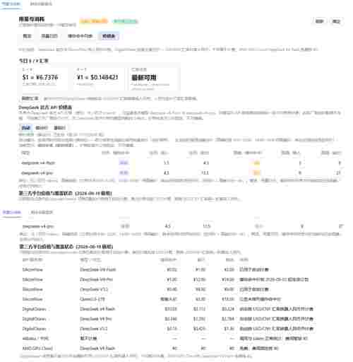

<div align="center">

# DeepSeek Harness 用量与消耗插件 v2

[English](./README.md) · **简体中文**

[本项目](https://github.com/Martin-soaring-dev/dsh-usage-plugin-v2) · [最新 Release](https://github.com/Martin-soaring-dev/dsh-usage-plugin-v2/releases/latest) · [原项目](https://github.com/feiyang-dev/dsh-usage-plugin)

**基于原项目继续开发的独立社区版本，重点扩展多服务商用量、计费与余额查询能力。**

</div>

---

## 关于这个 Fork

本仓库基于 [feiyang-dev/dsh-usage-plugin](https://github.com/feiyang-dev/dsh-usage-plugin) 继续开发。原项目提供了 DeepSeek Harness 中用量与消耗统计的核心能力；本 README 不再重复原项目的完整功能说明，而只集中展示本 Fork 新增和修改的内容。

如需查看原项目完整的功能介绍、安装说明、FAQ、数据路径与使用文档，请参阅：

- [原项目 GitHub 仓库](https://github.com/feiyang-dev/dsh-usage-plugin)
- [原项目 README 归档 — English](./README-origin.md)
- [原项目 README 归档 — 简体中文](./README-origin.zh.md)

## 本项目做了什么

### 多服务商余额查询

余额页从原本主要面向 DeepSeek，扩展为多服务商：

- **DeepSeek** —— 保留原有余额查询行为。
- **SiliconFlow** —— 从已配置的 SiliconFlow 模型提供商读取 API Key，仅允许访问 SiliconFlow 官方主机，并展示公开 API 返回的余额字段及字段解释。
- **DigitalOcean** —— 使用账户级 Personal Access Token，而不是 Gradient AI 推理 Key；查询账户 Billing API，并展示可用信用余额与本月至今使用。
- **AMD GPU Cloud** —— 明确说明当前没有公开文档化的推理 Key 余额接口，并提供官方控制台入口，不猜测、不调用未经确认的端点。

### 按 API 服务商区分成本

用量成本计算不再默认所有调用都来自同一个价格来源。插件会记录并展示 API 服务商与模型组合，允许不同服务商使用不同定价逻辑；没有可靠价格或明确不计费的路由可保持为 0，避免生成误导性估算。

### 汇率支持

DigitalOcean 账单使用 USD，而部分其它服务商使用 CNY。本 Fork 增加每日 USD/CNY 汇率查询与缓存，用于跨服务商成本展示，避免长期使用硬编码汇率。

### 更严格的凭据处理

不同服务商的凭据按照实际用途分开处理：

- 推理 API Key 与账户级 Billing Token 分离；
- DigitalOcean Token 保存后隐藏显示；
- 明文凭据不会回传到浏览器客户端；
- 对没有公开接口的服务商，不猜测、不探测未知端点。

### GitHub Releases-only 分发与插件内更新

本 Fork 通过 GitHub Releases 维护，不发布自己的 npm 包。插件内提供手动更新检查，可比较当前安装版本与最新 GitHub Release，并将新版本安装到当前 DSH profile。

## 界面预览

### GitHub Release 插件更新

插件可以在 DSH 设置中检查本仓库的最新 GitHub Release，并安装到当前 profile。


### 多服务商价格与 USD/CNY 汇率

价格表会展示当前 USD/CNY 汇率、DeepSeek 官方价格，以及 SiliconFlow、DigitalOcean、Alibaba / 千问和 AMD GPU Cloud 的第三方服务商定价与覆盖状态。



### 多服务商余额查询

余额页分别展示 DeepSeek、SiliconFlow、DigitalOcean 与 AMD GPU Cloud 的实际支持方式，而不是假定所有服务商都共享同一种余额接口。


### 本 Fork 的安装方式

使用标准 DeepSeek Harness CLI 时，不需要填写本地路径，也不需要 `cd`：

```bash
npm install -g @deepseek-ai/dsh
```

```bash
dsh plugin --profile web add "https://github.com/Martin-soaring-dev/dsh-usage-plugin-v2/archive/refs/tags/v1.13.5.tar.gz"
```

安装完成后重启 DeepSeek Harness：

```bash
dsh web
```

如果默认 Web 端口已被占用，可以指定其它端口，例如：

```bash
dsh web --port 3070
```

## AI 协作与维护声明

这是一个人机协作项目。本项目的开发、调试、测试、文档整理、发布准备与持续维护，由项目维护者在 **OpenAI Codex（ChatGPT）** 的协助下完成。项目维护者负责提出目标、审核结果、授权仓库修改，并对最终发布行为负责。

## 致谢与许可

原始设计和代码基础来自 [feiyang-dev/dsh-usage-plugin](https://github.com/feiyang-dev/dsh-usage-plugin) 及其贡献者。本 Fork 不替代、不冒充原项目。

MIT License。具体修改请以本仓库 Git 历史为准。
